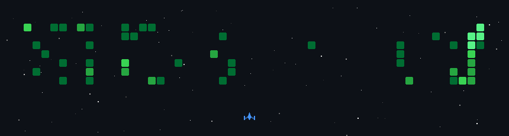

<h1 id="top" align="center">Hi, I'm Shriram Rai </h1></h1>

<p align="center">
  <a href="https://git.io/typing-svg"></a>
</p>

<div align="center">


<p align="center">
   
  
  
  
  
</p>


<div align="center">

<!-- 

[](https://user-badge.committers.top/egypt/AhmedNassar7)
-->
<a href="https://user-badge.committers.top/india/devshriram">
  
</a>

</div>

<!--
<div align="center">


-->

</div>

<p align="center"> <a href="https://github.com/ryo-ma/github-profile-trophy"></a> </p>

<div align="center">

<span>[<kbd> <br> About <br> </kbd>](#about)</span>
<span>[<kbd> <br> Socials <br> </kbd>](#social-media)</span>
<span>[<kbd> <br> Skills <br> </kbd>](#skills)</span>
<span>[<kbd> <br> Metrics <br> </kbd>](#metrics)</span>
<span>[<kbd> <br> Snake <br> </kbd>](#snake)</span>

</div>


<h2><a id="about"></a> About Me</h2>


- ⭐ I’m a `Software Engineer`.
  
- 🚀 Passionate about `Web Development`.

- 💡 Interested in contributing to `Open Source Projects`.

- 💬 Ask me about `Software Engineering`.

- 🎯 Focus on `Quality` over `Quantity`
  
- 🔍 Seeking an `Internship` or a `Job`.

- 🔄 Repeat `Brainstorming`, `Coding`, and `Debugging`.

- ✨ Enjoy my GitHub profile.

&nbsp;

<div align="center">
  
</div>

<!-- 


<h2><a id="work-experience"></a>💼 Work Experience</h2>

| 🏢 Company | 💼 Role |
| --- | --- |
| [Mercor](https://www.mercor.com/) | Software Engineer |
| [Datacurve](https://datacurve.ai/) | Open Source Developer |
| [Django](https://www.djangoproject.com/) | Member & Open Source Contributor |
| [Beshara](https://ebeshara.com/) | Java Developer |


<h2><a id="internship-experience"></a>💼 Internship Experience</h2>

| 🏢 Company | 💼 Role | ⏰ Duration |
| --- | --- | --- |
| [Deloitte](https://www.deloitte.com/middle-east/en.html) | MIH Program | Oct 2025 - Nov 2025 |
| [Orange Digital Center](https://www.orangedigitalcenters.com/country/EG/home) | Software Engineer Intern | Sep 2024 - Oct 2024 |
| [Arab African International Bank](https://www.aaib.com/) | Backend Developer Intern | Jul 2024 - Aug 2024 | 
| [Nokia](https://www.nokia.com/) | Software Engineer Intern | Aug 2023 - Oct 2023 |
| [Banque Misr](https://www.banquemisr.com/) | Frontend Developer Intern | Jul 2023 - Aug 2023 |


<h2><a id="open-source"></a>🤝 Open Source Contributions</h2>

| 📂 Repository | 💡 Contribution | 📝 Type | 🔗 PR | 📊 Status |
| --- | --- | --- | --- | --- |
| [Django](https://github.com/django/django) | Deprecated HTTP as the default protocol in `urlize` and `urlizetrunc` | Optimization | [#19240](https://github.com/django/django/pull/19240) |  |
| ↳ | Fixed contenttypes `shortcut()` view crash for a UUIDField pk | Bug | [#19296](https://github.com/django/django/pull/19296) |  |
| ↳ | Fixed test classes with `@translation.override` decorator | Bug | [#19358](https://github.com/django/django/pull/19358) |  |
| ↳ | Added docs for testing callable storage in FileField | Optimization | [#19349](https://github.com/django/django/pull/19349) |  |
| ↳ | Updated docs on gettext f-string support limitations | Documentation | [#19348](https://github.com/django/django/pull/19348) |  |
| ↳ | Optimized no-op migration performance on SQLite | Optimization | [#19278](https://github.com/django/django/pull/19278) |  |
| [Upwork Clone Frontend](https://github.com/activecourses/upwork-clone-frontend) | Set up Husky pre-commit hooks | DevOps | [#31](https://github.com/activecourses/upwork-clone-frontend/pull/31) |  |
| ↳ | Fixed props validation, line endings, and formatting | Code Style | [#32](https://github.com/activecourses/upwork-clone-frontend/pull/32) |  |


<h2><a id="training-experience"></a>📚 Training Experience</h2>

| 🏢 Organization | 💼 Role | ⏰ Duration | 📄 Certificate |
| --- | --- | --- | --- |
| [Information Technology Institute](https://iti.gov.eg/home) | Frontend using React Trainee | Sep 2024 - Sep 2024 | [Certificate](certificates/training/iti-react.pdf) |
| ↳ | Web Fundamentals Trainee | Aug 2024 - Sep 2024 | [Certificate](certificates/training/iti-web-development.pdf) |
| ↳ | Full Stack Web Development using Python Trainee | Jul 2024 - Aug 2024 | [Certificate](certificates/training/iti-python.pdf) |
| [Coach Academy](https://coachacademy.club/) | Competitive Programming II Trainee | Nov 2023 - April 2024 | [Certificate](certificates/training/coach-academy.pdf) |


<h2><a id="volunteering-experience"></a>🤝 Volunteering Experience</h2>

| 🏢 Student Clubs | 💼 Role | 📄 Certificates |
| --- | --- | --- |
| [GDSC Cairo University](https://www.linkedin.com/company/dsccairo/) | Software Developer Member | [Certificate](certificates/volunteering/gdsc-cu.pdf) |
| [GDSC Zagazig University](https://www.linkedin.com/company/google-dsc-zagazig/) | C++ Developer Member | [Certificate](certificates/volunteering/gdsc-zag.pdf) |
| [GDSC Al-Azhar University](https://www.linkedin.com/company/gdgcalazhar/) | C++ Developer Member | [Certificate](certificates/volunteering/gdsc-azhar.png) |
| [ACES](https://www.linkedin.com/company/acesegypt/) | IT Member | [Certificate](certificates/volunteering/aces.pdf) |
| [Open Source Community](https://www.linkedin.com/company/osc---open-source-community/) | Web Developer Member | [Acceptance](certificates/others/acceptance-osc.jpeg) |
| [SemiColon](https://www.linkedin.com/company/semicolon.org/) | Data Structure & Algorithms Head | [Core Team](certificates/others/core-team-semicolon.jpeg) |
| [Enactus Modern Academy](https://www.linkedin.com/company/enactus-modern-academy/) | IT Member | [Acceptance](certificates/others/acceptance-enactus.jpeg) |
| [GDSC Modern Academy](https://www.linkedin.com/company/gdg-campus-modern-academy-for-computer-science/) | Event Manager Member | [Certificate](certificates/volunteering/gdsc-ma.jpg) |
| [Techne](https://www.linkedin.com/company/techne.me/) | Event Organizer | [Certificate 2023](certificates/volunteering/techne-23.jpg) \| [Certificate 2024](certificates/volunteering/techne-24.pdf) |
| [Egypt Career Summit](https://www.linkedin.com/company/egypt-career-summit/) | Event Organizer | [Certificate](certificates/volunteering/ecs.png) |
| [iCareer](https://www.linkedin.com/company/icareereg/) | Event Organizer | [Core Team](certificates/others/core-team-icareer.jpeg) |
| [Startups Without Borders](https://www.linkedin.com/company/startups-without-borders-eg/) | Event Organizer | [Acceptance](certificates/others/acceptance-swb.jpeg) |
| [MSP Tech Club Al-Azhar University](https://www.linkedin.com/company/msp-tech-club-al-azhar-university/) | Frontend Developer Member | [Acceptance](certificates/others/acceptance-msp.jpeg) |
| [IEEENU CIS](https://www.linkedin.com/company/ieeenu-cis/) | AI Engineer Member | [Acceptance](certificates/others/acceptance-nu.jpeg) |
| [IEEE ASUSB](https://www.linkedin.com/company/ieee-asusb/) | Fundraiser Member | [Acceptance](certificates/others/acceptance-asu.jpeg) |


 -->


<h2><a id="social-media"></a> Social Media</h2>

<a href="https://linkedin.com/in/shriram-rai" target="_blank"></a> 
&nbsp;
<a href="https://wa.me/7009080883" target="_blank"></a>
&nbsp;
<a href="https://t.me/F4xAlt" target="_blank"></a>
&nbsp;
<a href="https://instagram.com/_shriramrai_" target="_blank"></a>
&nbsp;

<!-- 
&nbsp; 
<a href="https://www.hackerrank.com/a_moh_nassar00" target="_blank"></a>
&nbsp; 
<a href="https://codeforces.com/profile/AhmedNassar7" target="_blank"></a> 
-->


<!--  -->


<h2><a id="skills"></a> Technical Skills</h2>

<!--
<p align="center">
  <a href="https://skillicons.dev">
    
  </a>
</p>
-->

<!-- <div align="center">
  
  
  
  
  
  
  
  
</div> -->

<h3>
  <a id="programming-languages"></a>
  <picture style="display: inline;">
    
  </picture>
  Programming Languages
</h3>  

<a href="https://skillicons.dev">
  
</a>

<h3>
  <a id="programming-languages"></a>
  <picture style="display: inline;">
    
  </picture>
  Web Development
</h3>  

<a href="https://skillicons.dev">
  
</a>

### 🗄️ Databases  
<!-- <a href="https://skillicons.dev">
  
</a> -->

### ☁️ Cloud & DevOps  
<!-- <a href="https://skillicons.dev">
  
</a> -->

### ⚙️ Tools & Platforms  
<!-- <a href="https://skillicons.dev">
  
</a> -->


<!-- 


<h2><a id="github-stats"></a> Github Stats</h2>
<div align="center">
	


<a href="https://git.io/streak-stats"></a>

<td colspan="2" style="text-align: center;">
  
</td>


</div> -->

<!--  -->

<h2><a id="metrics"></a> GitHub Metrics</h2>

<table>
  <tr>
    <td width="50%">
      
    </td>
    <td width="50%">
      
    </td>
  </tr>
</table>

<table>
  <tr>
    <td width="50%">
      
    </td>
    <td width="50%">
      
    </td>
  </tr>
</table>


<!--  -->

<!-- <h2><a id="game"></a>🎮 My GitHub Space Shooter Game</h2>
 
<p align="center">
  
</p> -->

<!--  -->


<h2>🐍 Snake Eating My Contributions</h2>

<p align="center">
  
</p>


<h2>:book: Guest Book</h2>

<p align="center"><a href="#top"></a></p>


```

